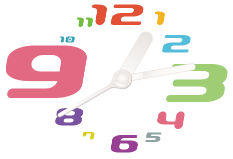

# Javascriptで時計を作成してみよう


## スライド資料
[資料へのリンク](https://drive.google.com/file/d/1Kf8A2DaVexGWCoJAmtOE-C-4WMAAhjVF/view?usp=sharing)
<br>

## 完成イメージ
[完成イメージへのリンク](https://tec-yoshi-taka.github.io/analog-clock-finish/clock_finish.html)
<br><br>
---

# Javascriptのコードの部分はこちらを参照してください。

---

## スライド P.10
### まずは32行目に下記を入力してみよう

```javascript
const now = new Date();
let hour = now.getHours();
alert(hour); 
```

#### 今が13時の場合

<br>

---

## スライド P.19
### 先程のコードに追記してみよう

```javascript
const time = document.querySelector('#time');

const now = new Date();
let hour = now.getHours();
// alert(hour); 
time.innerHTML = `${hour}:00:00`;

```
## 下記のような表示になります
#### 今が14時の場合


<br>

---

## スライド P.24
### 時刻を表示してみよう

```javascript
// alert(hour); 
let min = now.getMinutes();
let sec = now.getSeconds();

time.innerHTML = `${hour}:${min}:${sec}`;
```
## 下記のような表示になります
#### 今が14時13分43秒の場合


<br>

---

## スライド P.29
### デジタル時計を動かしてみよう

```javascript
const clock = () => {
    const now = new Date();
    let hour = now.getHours();
    // alert(hour); 
    let min = now.getMinutes();
    let sec = now.getSeconds();

    time.innerHTML = `${hour}:${min}:${sec}`;
    requestAnimationFrame(clock);
}
clock();
```
### デジタル時計が動きだします  
<br>


---

## スライド P.32
### 二桁表示にしてみよう

```javascript

time.innerHTML = `${`0${hour}`.slice(-2)}:${`0${min}`.slice(-2)}:${`0${sec}`.slice(-2)}`;

```
### 全て二桁表示になります


<br>

---

# アナログ時計の針を動かそう

## スライド P.33
### 短針のみを動かしてみよう
```javascript

hourHand.style.transform = `rotate(30deg)`;

```
### 短針が30度傾きます


<br>


---

## スライド P.34
### ３つの針を好きな傾きに動かしてみよう  

```javascript

hourHand.style.transform = `rotate(30deg)`;
minHand.style.transform = `rotate(80deg)`;
secHand.style.transform = `rotate(240deg)`;

```
### ３つの針が別々に傾きます


<br>


---

## スライド P.36
### ３つの針を時刻に合わせて動かしてみよう  

```javascript

hourHand.style.transform = `rotate(${hour*30}deg)`;
minHand.style.transform = `rotate(${min*6}deg)`;
secHand.style.transform = `rotate(${sec*6}deg)`;

```
### ３つの針が時刻に合わせて動きます
<br>

---

## スライド P.38
### 短針を正確な位置に合わせよう  

```javascript

hourHand.style.transform = `rotate(${(hour+min/60)*30}deg)`;

```

---

