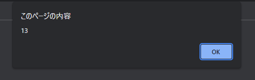

# Javascriptで時計を作成してみよう

## Javascriptのコードの部分はこちらを参照してください。

---

## スライド P.10
### まずは32行目に下記を入力してみよう

```javascript
const now = new Date();
let hour = now.getHours();
alert(hour); 
```

#### 今が13時の場合


---

## スライド P.19
### 先程のコードに追記してみよう

```javascript
const time = document.querySelector('#time');

const now = new Date();
let hour = now.getHours();
// alert(hour); 
time.innerHTML = `${hour}:00:00`;

```
## 下記のような表示になります